```mermaid
%%{init: {"flowchart": {"curve": "linear", "nodeSpacing": 14, "rankSpacing": 8, "padding": 4}, "themeVariables": {"fontSize": "15px"}}}%%
flowchart LR
    accTitle: Journey Overview: this release
    accDescr: Region order and activity modes only. Select a node to open its journey guide. The map ends at the Public v0.57a cutoff.
    redroot["Redroot<br/>Town"]
    wilds["Redroot<br/>Wilds<br/>Travel"]
    aris["Aris<br/>Town /<br/>exploration"]
    plains["Crystal<br/>Plains<br/>Travel"]
    unknown["???<br/>Local<br/>activities"]
    vale["Shieldfall<br/>Vale<br/>Travel /<br/>camp"]
    spice["Spiceport<br/>Town /<br/>exploration"]
    grove["Blueleaf<br/>Grove<br/>Camp /<br/>local activities"]
    cutoff["Public v0.57a<br/>cutoff"]
    redroot --> wilds
    wilds --> aris
    aris --> plains
    plains --> unknown
    unknown --> vale
    vale --> spice
    spice --> grove
    grove --> cutoff
    click redroot href "guide/redroot.html#redroot" "Redroot Town" _self
    click wilds href "guide/redroot.html#redroot-wilds" "Redroot Wilds Travel" _self
    click aris href "guide/aris.html#aris" "Aris Town / exploration" _self
    click plains href "guide/crystal-plains-shieldfall.html#crystal-plains" "Crystal Plains Travel" _self
    click unknown href "guide/crystal-plains-shieldfall.html#question-mark-sequence" "??? Local activities" _self
    click vale href "guide/crystal-plains-shieldfall.html#shieldfall-vale" "Shieldfall Vale Travel / camp" _self
    click spice href "guide/spiceport.html#spiceport-early-excursions" "Spiceport Town / exploration" _self
    click grove href "guide/blueleaf-grove.html#blueleaf-grove" "Blueleaf Grove Camp / local activities" _self
    click cutoff href "guide/blueleaf-grove.html#where-public-v0.57a-ends" "Public v0.57a cutoff" _self
```

<!-- Generated from story_map_contracts.json; edit its locale labels, not topology here. -->

<strong>Journey Overview: this release</strong>

Select a node for the guide. Drag to pan; Ctrl / pinch to zoom. The full map supports wheel and trackpad, arrow keys, + / −, 0 / F to reset the view, and Esc to close.

<ol class="kt-map-compact-overview"><li><a href="guide/redroot.html#redroot">Redroot · Town</a></li><li><a href="guide/redroot.html#redroot-wilds">Redroot Wilds · Travel</a></li><li><a href="guide/aris.html#aris">Aris · Town / exploration</a></li><li><a href="guide/crystal-plains-shieldfall.html#crystal-plains">Crystal Plains · Travel</a></li><li><a href="guide/crystal-plains-shieldfall.html#question-mark-sequence">??? · Local activities</a></li><li><a href="guide/crystal-plains-shieldfall.html#shieldfall-vale">Shieldfall Vale · Travel / camp</a></li><li><a href="guide/spiceport.html#spiceport-early-excursions">Spiceport · Town / exploration</a></li><li><a href="guide/blueleaf-grove.html#blueleaf-grove">Blueleaf Grove · Camp / local activities</a></li><li><a href="guide/blueleaf-grove.html#where-public-v0.57a-ends">Public v0.57a cutoff</a></li></ol>

Region order and activity modes only. Select a node to open its journey guide. The map ends at the Public v0.57a cutoff.

Text links

<a href="guide/redroot.html#redroot">Redroot · Town</a> · <a href="guide/redroot.html#redroot-wilds">Redroot Wilds · Travel</a> · <a href="guide/aris.html#aris">Aris · Town / exploration</a> · <a href="guide/crystal-plains-shieldfall.html#crystal-plains">Crystal Plains · Travel</a> · <a href="guide/crystal-plains-shieldfall.html#question-mark-sequence">??? · Local activities</a> · <a href="guide/crystal-plains-shieldfall.html#shieldfall-vale">Shieldfall Vale · Travel / camp</a> · <a href="guide/spiceport.html#spiceport-early-excursions">Spiceport · Town / exploration</a> · <a href="guide/blueleaf-grove.html#blueleaf-grove">Blueleaf Grove · Camp / local activities</a> · <a href="guide/blueleaf-grove.html#where-public-v0.57a-ends">Public v0.57a cutoff</a>

