```mermaid
%%{init: {"flowchart": {"curve": "linear", "nodeSpacing": 14, "rankSpacing": 8, "padding": 4}, "themeVariables": {"fontSize": "15px"}}}%%
flowchart LR
    accTitle: Journey Overview：当前版本旅程
    accDescr: 只显示地区顺序与活动模式；点击节点回到旅程页。本图到 Public v0.57a 当前截止位置为止。
    redroot["红根镇<br/>Town"]
    wilds["红根镇荒野<br/>Travel"]
    aris["阿瑞斯<br/>Town /<br/>exploration"]
    plains["水晶平原<br/>Travel"]
    unknown["???<br/>Local<br/>activities"]
    vale["盾落谷<br/>Travel /<br/>camp"]
    spice["斯派斯港<br/>Town /<br/>exploration"]
    grove["蓝叶森林<br/>Camp /<br/>local activities"]
    cutoff["Public v0.57a<br/>cutoff"]
    redroot --> wilds
    wilds --> aris
    aris --> plains
    plains --> unknown
    unknown --> vale
    vale --> spice
    spice --> grove
    grove --> cutoff
    click redroot href "guide/redroot.html#redroot" "红根镇 Town" _self
    click wilds href "guide/redroot.html#redroot-wilds" "红根镇荒野 Travel" _self
    click aris href "guide/aris.html#阿瑞斯aris" "阿瑞斯 Town / exploration" _self
    click plains href "guide/crystal-plains-shieldfall.html#crystal-plains" "水晶平原 Travel" _self
    click unknown href "guide/crystal-plains-shieldfall.html#question-mark-sequence" "??? Local activities" _self
    click vale href "guide/crystal-plains-shieldfall.html#shieldfall-vale" "盾落谷 Travel / camp" _self
    click spice href "guide/spiceport.html#spiceport-early-excursions" "斯派斯港 Town / exploration" _self
    click grove href "guide/blueleaf-grove.html#蓝叶森林blueleaf-grove" "蓝叶森林 Camp / local activities" _self
    click cutoff href "guide/blueleaf-grove.html#public-v0.57a-当前截止位置" "Public v0.57a cutoff" _self
```

<!-- Generated from story_map_contracts.json; edit its locale labels, not topology here. -->

<strong>Journey Overview：当前版本旅程</strong>

点击节点查正文；拖动平移，Ctrl／捏合缩放。完整图支持滚轮与触控板；方向键平移，＋／－缩放，0／F 重置视图，Esc 关闭。

<ol class="kt-map-compact-overview"><li><a href="guide/redroot.html#redroot">红根镇 · Town</a></li><li><a href="guide/redroot.html#redroot-wilds">红根镇荒野 · Travel</a></li><li><a href="guide/aris.html#阿瑞斯aris">阿瑞斯 · Town / exploration</a></li><li><a href="guide/crystal-plains-shieldfall.html#crystal-plains">水晶平原 · Travel</a></li><li><a href="guide/crystal-plains-shieldfall.html#question-mark-sequence">??? · Local activities</a></li><li><a href="guide/crystal-plains-shieldfall.html#shieldfall-vale">盾落谷 · Travel / camp</a></li><li><a href="guide/spiceport.html#spiceport-early-excursions">斯派斯港 · Town / exploration</a></li><li><a href="guide/blueleaf-grove.html#蓝叶森林blueleaf-grove">蓝叶森林 · Camp / local activities</a></li><li><a href="guide/blueleaf-grove.html#public-v0.57a-当前截止位置">Public v0.57a cutoff</a></li></ol>

只显示地区顺序与活动模式；点击节点回到旅程页。本图到 Public v0.57a 当前截止位置为止。

文字链接

<a href="guide/redroot.html#redroot">红根镇 · Town</a> · <a href="guide/redroot.html#redroot-wilds">红根镇荒野 · Travel</a> · <a href="guide/aris.html#阿瑞斯aris">阿瑞斯 · Town / exploration</a> · <a href="guide/crystal-plains-shieldfall.html#crystal-plains">水晶平原 · Travel</a> · <a href="guide/crystal-plains-shieldfall.html#question-mark-sequence">??? · Local activities</a> · <a href="guide/crystal-plains-shieldfall.html#shieldfall-vale">盾落谷 · Travel / camp</a> · <a href="guide/spiceport.html#spiceport-early-excursions">斯派斯港 · Town / exploration</a> · <a href="guide/blueleaf-grove.html#蓝叶森林blueleaf-grove">蓝叶森林 · Camp / local activities</a> · <a href="guide/blueleaf-grove.html#public-v0.57a-当前截止位置">Public v0.57a cutoff</a>

