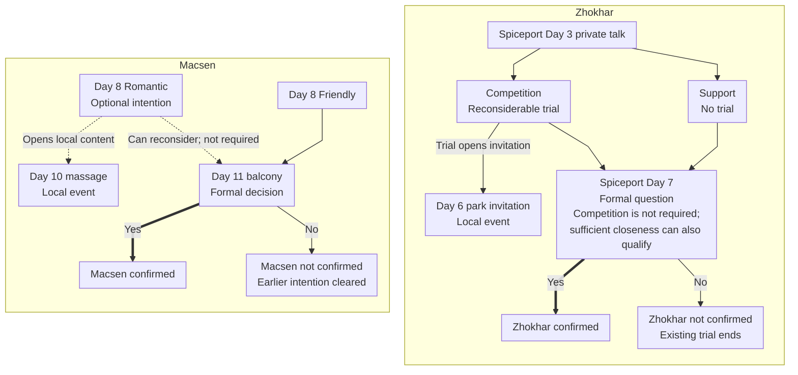

<!-- Generated from story_map_contracts.json; edit its locale labels, not topology here. -->

<strong>Formal relationships: Macsen and Zhokhar</strong>

The current version allows one confirmed partner route. Confirming Macsen closes Zhokhar’s formal relationship progression and Ray’s nest invitation.

Select a node for the guide. Drag to pan; Ctrl / pinch to zoom. The full map supports wheel and trackpad, arrow keys, + / −, 0 / F to reset the view, and Esc to close.

<a href="#prepare-zhokhar">Zhokhar</a> — Warehouse is one way to prepare the relationship, not a requirement.

Without confirmed Macsen, Zhokhar remains possible, subject to his own conditions. Keep a normal save before the Day 11 balcony decision to compare branches.

<strong>Local invitations</strong>

<strong>Ray</strong> — A local nest invitation that night in ???; requires the relevant preparation and no confirmed Macsen. Accepting does not confirm a partner.

<a href="#prepare-ray">Preparation</a> · <a href="#question-mark-ray">That night’s invitation</a>

<strong>Cabotte</strong> — A local invitation after the Wilds Day 8 conditions are met. Sure enters that night’s event without confirming a partner.

<a href="#cabotte-wilds">Invitation conditions</a>

Text links

<a href="#macsen-early">Day 8 Romantic · Optional intention</a> · <a href="#macsen-day10-massage">Day 10 massage · Local event</a> · <a href="#macsen-early">Day 8 Friendly</a> · <a href="#macsen-balcony">Day 11 balcony · Formal decision</a> · <a href="#macsen-balcony">Macsen confirmed</a> · <a href="#macsen-balcony">Macsen not confirmed · Earlier intention cleared</a> · <a href="#zhokhar-spiceport">Spiceport Day 3 private talk</a> · <a href="#zhokhar-spiceport">Competition · Reconsiderable trial</a> · <a href="#zhokhar-spiceport">Support · No trial</a> · <a href="#zhokhar-spiceport">Day 6 park invitation · Local event</a> · <a href="#zhokhar-spiceport">Spiceport Day 7 · Formal question</a> · <a href="#zhokhar-spiceport">Zhokhar confirmed</a> · <a href="#zhokhar-spiceport">Zhokhar not confirmed · Existing trial ends</a>

