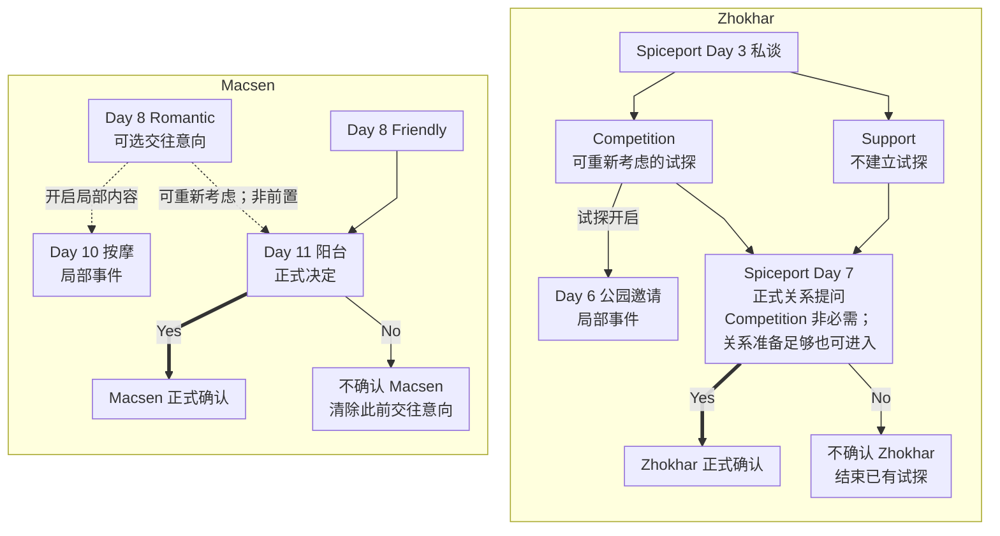

<!-- Generated from story_map_contracts.json; edit its locale labels, not topology here. -->

<strong>正式关系：Macsen 与 Zhokhar</strong>

当前版本只可正式确认一条伴侣路线；确认 Macsen 后，Zhokhar 的正式关系进展与 Ray 的同巢邀请不再开放。

点击节点查正文；拖动平移，Ctrl／捏合缩放。完整图支持滚轮与触控板；方向键平移，＋／－缩放，0／F 重置视图，Esc 关闭。

<a href="#prepare-zhokhar">Zhokhar</a> — Warehouse 是其中一种关系准备方式，并非必需。

Macsen 未正式确认时，Zhokhar 的可能性仍开放，但仍须满足 Zhokhar 自身条件。比较分支前，在 Day 11 阳台决定前留普通存档。

<strong>其他局部邀请</strong>

<strong>Ray</strong> — ??? 当晚的局部同巢邀请；需要对应准备且无 confirmed Macsen；接受不会确认伴侣。

<a href="#prepare-ray">准备</a> · <a href="#question-mark-ray">当晚邀请</a>

<strong>Cabotte</strong> — Wilds Day 8 条件满足后的局部邀请；Sure 进入当晚事件，不会确认伴侣。

<a href="#cabotte-wilds">邀请条件</a>

文字链接

<a href="#macsen-early">Day 8 Romantic · 可选交往意向</a> · <a href="#macsen-day10-massage">Day 10 按摩 · 局部事件</a> · <a href="#macsen-early">Day 8 Friendly</a> · <a href="#macsen-balcony">Day 11 阳台 · 正式决定</a> · <a href="#macsen-balcony">Macsen 正式确认</a> · <a href="#macsen-balcony">不确认 Macsen · 清除此前交往意向</a> · <a href="#zhokhar-spiceport">Spiceport Day 3 私谈</a> · <a href="#zhokhar-spiceport">Competition · 可重新考虑的试探</a> · <a href="#zhokhar-spiceport">Support · 不建立试探</a> · <a href="#zhokhar-spiceport">Day 6 公园邀请 · 局部事件</a> · <a href="#zhokhar-spiceport">Spiceport Day 7 · 正式关系提问</a> · <a href="#zhokhar-spiceport">Zhokhar 正式确认</a> · <a href="#zhokhar-spiceport">不确认 Zhokhar · 结束已有试探</a>

