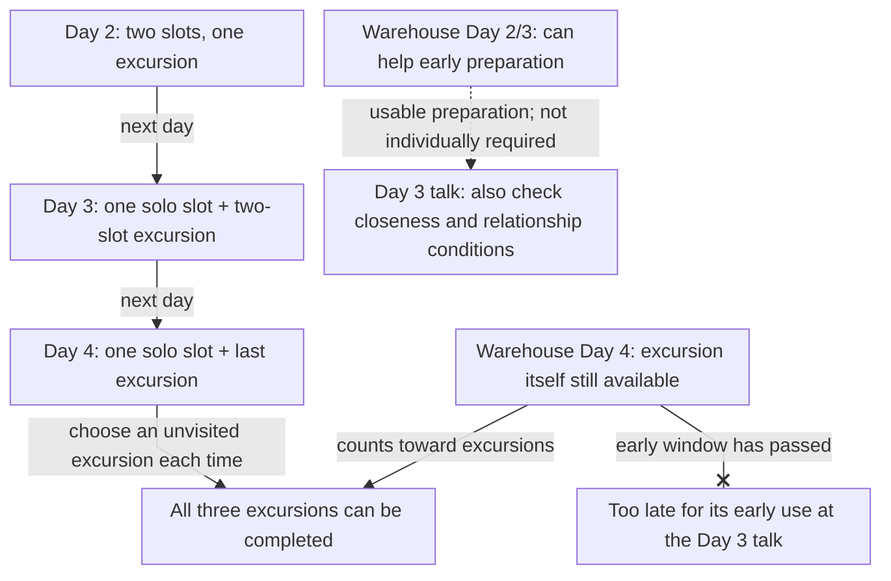

<!-- Generated from story_map_contracts.json; edit its locale labels, not topology here. -->

<strong>Days 2–4: excursions and early uses</strong>

Select a node for the guide. Drag to pan; Ctrl / pinch to zoom. The full map supports wheel and trackpad, arrow keys, + / −, 0 / F to reset the view, and Esc to close.

An activity can remain available after an earlier event that depended on it has passed. Day 4 Warehouse completion does not recover Day 3 preparation. The table below retains exact time-slot information.

Text links

<a href="#spiceport-early-excursions">Day 2: two slots, one excursion</a> · <a href="#spiceport-early-excursions">Day 3: one solo slot + two-slot excursion</a> · <a href="#spiceport-early-excursions">Day 4: one solo slot + last excursion</a> · <a href="#spiceport-early-excursions">All three excursions can be completed</a> · <a href="#spiceport-early-excursions">Warehouse Day 2/3: can help early preparation</a> · <a href="../reference/relationships.html#prepare-zhokhar">Day 3 talk: also check closeness and relationship conditions</a> · <a href="#spiceport-early-excursions">Warehouse Day 4: excursion itself still available</a> · <a href="#spiceport-early-excursions">Too late for its early use at the Day 3 talk</a>

