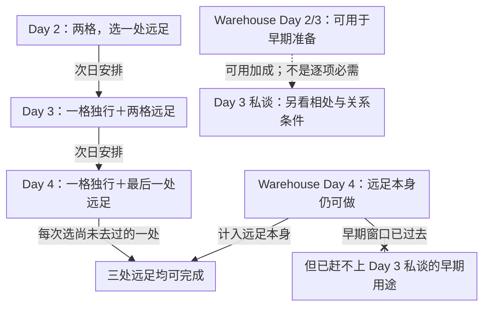

<!-- Generated from story_map_contracts.json; edit its locale labels, not topology here. -->

<strong>Day 2–4：远足安排与早期用途</strong>

点击节点查正文；拖动平移，Ctrl／捏合缩放。完整图支持滚轮与触控板；方向键平移，＋／－缩放，0／F 重置视图，Esc 关闭。

活动还能完成，不等于依赖它的早期事件还能赶上。Warehouse Day 4 的远足与 Day 3 私谈必须分开判断；时间格的精确信息仍见下表。

文字链接

<a href="#spiceport-early-excursions">Day 2：两格，选一处远足</a> · <a href="#spiceport-early-excursions">Day 3：一格独行＋两格远足</a> · <a href="#spiceport-early-excursions">Day 4：一格独行＋最后一处远足</a> · <a href="#spiceport-early-excursions">三处远足均可完成</a> · <a href="#spiceport-early-excursions">Warehouse Day 2/3：可用于早期准备</a> · <a href="../reference/relationships.html#prepare-zhokhar">Day 3 私谈：另看相处与关系条件</a> · <a href="#spiceport-early-excursions">Warehouse Day 4：远足本身仍可做</a> · <a href="#spiceport-early-excursions">但已赶不上 Day 3 私谈的早期用途</a>

