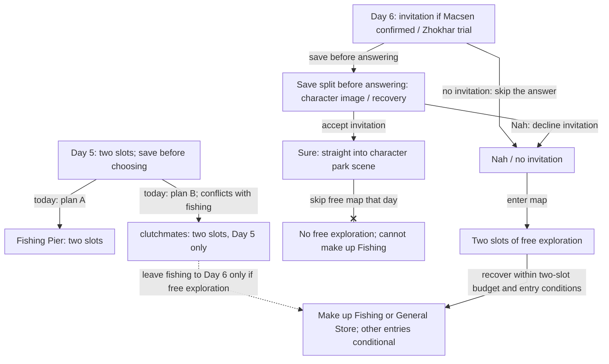

<!-- Generated from story_map_contracts.json; edit its locale labels, not topology here. -->

<strong>Days 5–6: conflicts and recovery</strong>

Select a node for the guide. Drag to pan; Ctrl / pinch to zoom. The full map supports wheel and trackpad, arrow keys, + / −, 0 / F to reset the view, and Esc to close.

The Day 5 adult clutchmates invitation also requires no confirmed Macsen. Day 6 invitations are not one activity inside the free map: Sure enters the scene; Nah / no invitation gives two free slots. Solo park and nursery entries have separate conditions in the text.

Text links

<a href="#spiceport-day5">Day 5: two slots; save before choosing</a> · <a href="#spiceport-day5">Fishing Pier: two slots</a> · <a href="#spiceport-day5">clutchmates: two slots, Day 5 only</a> · <a href="#spiceport-day6">Day 6: invitation if Macsen confirmed / Zhokhar trial</a> · <a href="#spiceport-day6">Sure: straight into character park scene</a> · <a href="#spiceport-day6">No free exploration; cannot make up Fishing</a> · <a href="#spiceport-day6">Nah / no invitation</a> · <a href="#spiceport-day6">Two slots of free exploration</a> · <a href="#spiceport-day6">Make up Fishing or General Store; other entries conditional</a> · <a href="#spiceport-day6">Save split before answering: character image / recovery</a>

