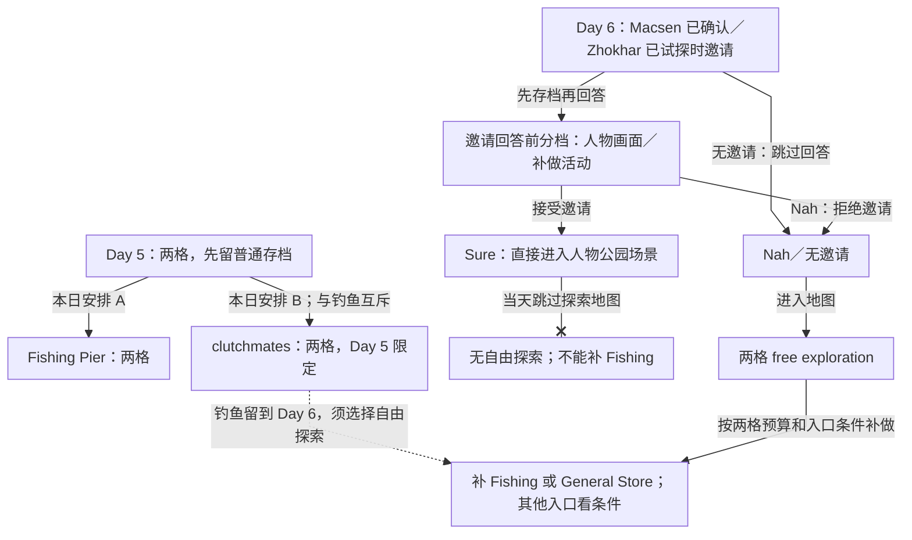

<!-- Generated from story_map_contracts.json; edit its locale labels, not topology here. -->

<strong>Day 5–6：时间竞争与恢复分支</strong>

点击节点查正文；拖动平移，Ctrl／捏合缩放。完整图支持滚轮与触控板；方向键平移，＋／－缩放，0／F 重置视图，Esc 关闭。

Day 5 clutchmates 成人邀约另须没有 Macsen 正式关系。Day 6 人物邀请并非自由地图中的一次活动：Sure 直接进入场景；Nah／无邀请才有两格探索。独自公园与托儿所入口另有条件，见正文。

文字链接

<a href="#spiceport-day5">Day 5：两格，先留普通存档</a> · <a href="#spiceport-day5">Fishing Pier：两格</a> · <a href="#spiceport-day5">clutchmates：两格，Day 5 限定</a> · <a href="#spiceport-day6">Day 6：Macsen 已确认／Zhokhar 已试探时邀请</a> · <a href="#spiceport-day6">Sure：直接进入人物公园场景</a> · <a href="#spiceport-day6">无自由探索；不能补 Fishing</a> · <a href="#spiceport-day6">Nah／无邀请</a> · <a href="#spiceport-day6">两格 free exploration</a> · <a href="#spiceport-day6">补 Fishing 或 General Store；其他入口看条件</a> · <a href="#spiceport-day6">邀请回答前分档：人物画面／补做活动</a>

